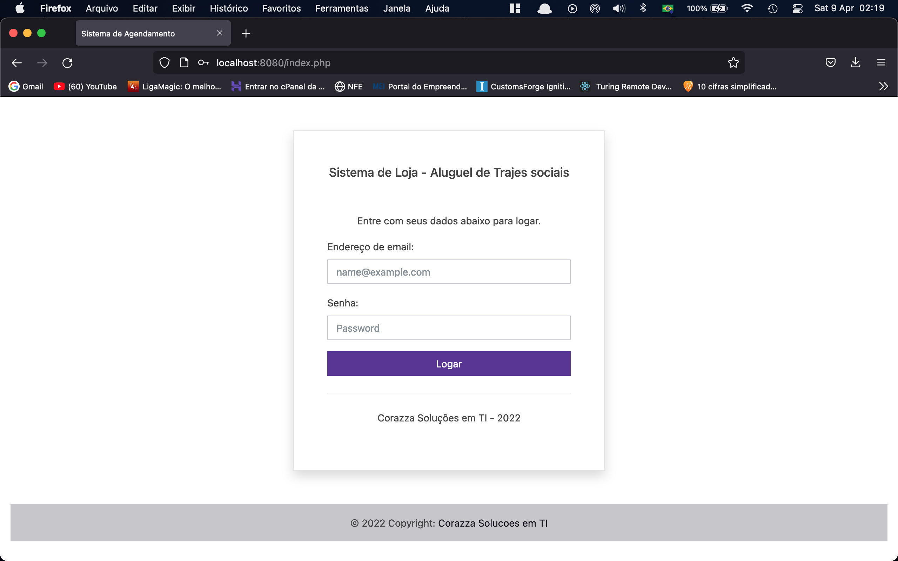
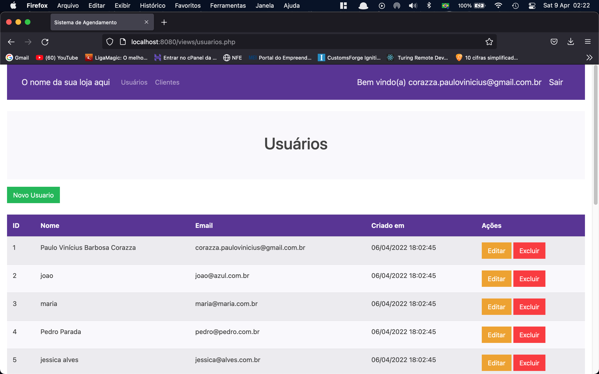
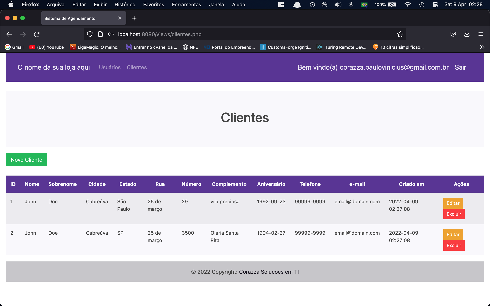
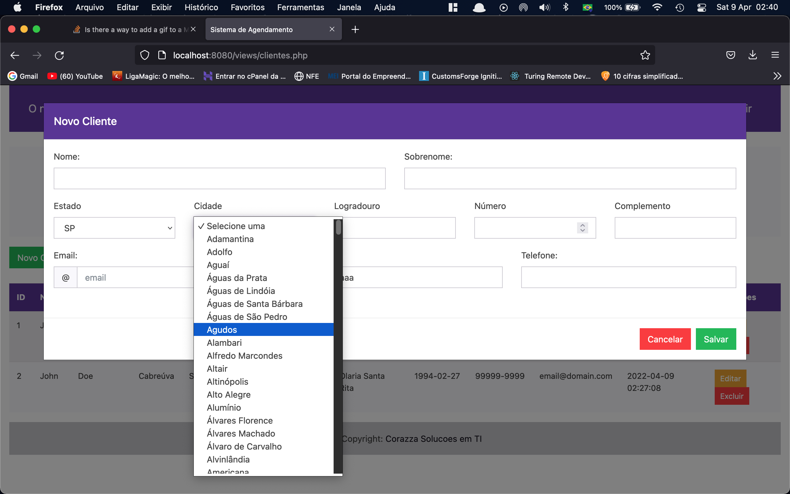

# sistema_aluguel_roupas

## Tela de Login

## Cadastro de usuários

## Cadastro de Clientes

## Cadastro de Clientes

### Feito com PHP 8.1.4 Vanilla
### Bootstrap 5.X.X
### MySQL
### Javascript
### API IBGE para buscar estados e municípios
